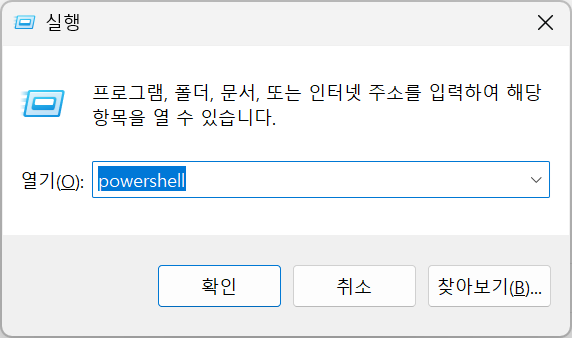
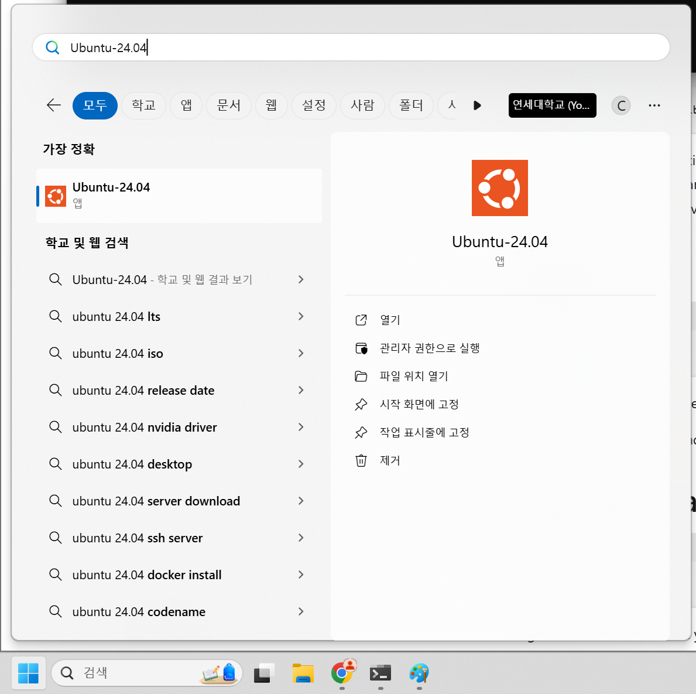
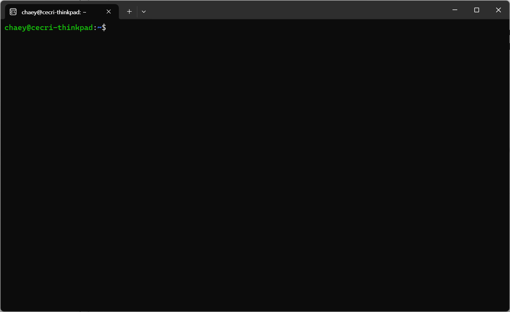

# Homework 0

Throughout the course, we will use GCC version &ge; 14. Students are recommended to set up the compiler to their system.

## Windows

The best and easiest way to set up GCC version 14 is to use Windows subsystem for linux (WSL).
First, open your Powershell by pressing &#x229E;+R and enter "powershell".



Within powershell, enter the following command to install
```bat
$ wsl --install -d Ubuntu-24.04
```

After installing it, you will be able to find Ubuntu-24.04.



Running it will give you the following terminal.



Now run the following command to the shell
```bash
$ sudo apt update
$ sudo apt install build-essential
$ sudo apt install gcc
$ sudo apt install gcc-14
$ sudo apt install g++
$ sudo apt install g++-14
```

The system now has two installed gcc versions (13 and 14). 
```bash
$ gcc --version # This will give 13.X.X
$ gcc-14 --version # This will give 14.X.X
```

To make `gcc-14` to default, we need to run the following commands
```bash
$ sudo update-alternatives --install /usr/bin/gcc gcc /usr/bin/gcc-13 60 --slave /usr/bin/g++ g++ /usr/bin/g++-13
$ sudo update-alternatives --install /usr/bin/gcc gcc /usr/bin/gcc-14 40 --slave /usr/bin/g++ g++ /usr/bin/g++-14
$ sudo update-alternatives --config gcc
```

The last command will give us something like below:
```bash
$ sudo update-alternatives --config gcc
There are 2 choices for the alternative gcc (providing /usr/bin/gcc).

  Selection    Path             Priority   Status
------------------------------------------------------------
* 0            /usr/bin/gcc-13   60        auto mode
  1            /usr/bin/gcc-13   60        manual mode
  2            /usr/bin/gcc-14   40        manual mode

Press <enter> to keep the current choice[*], or type selection number: 
```

Type the number which is for `gcc-14`. For example, for the above case, Selection "2" is for "gcc-14". Thus, type 2 and press enter &#x23CE;.
After that, we will get
```bash
$ gcc --version
gcc (Ubuntu 14.2.0-4ubuntu2~24.04) 14.2.0
Copyright (C) 2024 Free Software Foundation, Inc.
This is free software; see the source for copying conditions.  There is NO
warranty; not even for MERCHANTABILITY or FITNESS FOR A PARTICULAR PURPOSE.

$ g++ --version
g++ (Ubuntu 14.2.0-4ubuntu2~24.04) 14.2.0
Copyright (C) 2024 Free Software Foundation, Inc.
This is free software; see the source for copying conditions.  There is NO
warranty; not even for MERCHANTABILITY or FITNESS FOR A PARTICULAR PURPOSE.
```

## MacOS

MacOS users can install gcc version 14 using [homebrew](https://brew.sh/).
First, open a terminal and enter the following command
```bash
$ /bin/bash -c "$(curl -fsSL https://raw.githubusercontent.com/Homebrew/install/HEAD/install.sh)"
```
Then, follow the "next step" presented in the terminal.

Then
```bash
$ brew install gcc
```
will install gcc version 14 to a system. Still, it will be installed in `/opt/homebrew/bin`. Without adding it to your terminal, you will run a default `gcc`, which is just `clang`.

Thus, you should run the following lines
```bash
$ cd /opt/homebrew/bin/
$ ln -s gcc-14 gcc
$ ln -s g++-14 g++
$ cd -
$ echo 'export PATH="/opt/homebrew/bin/;$PATH"' >> .zprofile
```

Then, after reopenning the terminal, you will get
```bash
$ gcc --version
```

