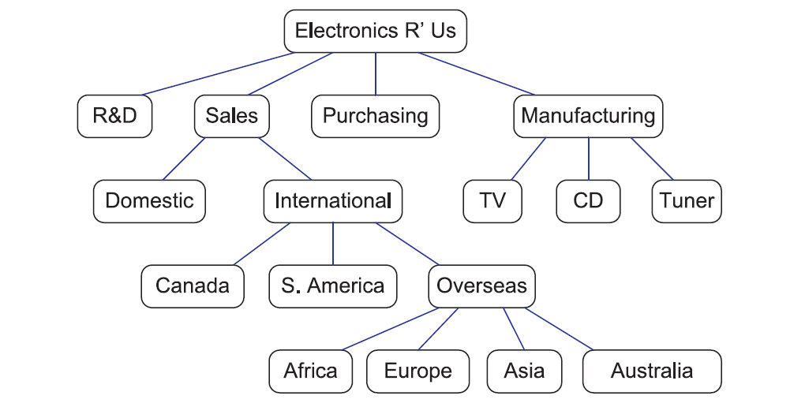

# Homework 2

### Due Date: June 2nd (Mon) 11:59 PM

### Please submit your code to LearnUS 

## Some useful tips 

When giving input using the standard input stream, you can indicate the end of file using Ctrl+D.

To stop the program, press Ctrl+C.


## Problem 1: Helping Minsoo, a space explorer

Minsoo, a space explorer, arrived at a planet called "Asgard" yesterday. On this planet, there is an interesting metal named Uru.

Uru is really strong material, but it is difficult to process. Most of the Uru pieces Minsoo found are small.
So, Minsoo collects many small Uru pieces to forge a large hammer, which he would call "Mjölnir" and use to explore the planet.

Uru has a property that, to merge two Uru pieces weighing A and B grams, an electrical energy A+B is required.
For example, merging one piece of Uru weighing 4 grams with another piece weighing 6 grams requires an energy of 4 + 6, resulting in a single 10-gram Uru piece.

Currently, Minsoo has $N$ pieces of Uru. He wants to merge all these pieces into a single piece.
However, the furnace in Minsoo's spaceship does not have unlimited energy, so his goal is to merge the pieces in a way that minimizes the total energy required.

Help Minsoo to merge Uru pieces!

<figure>

<figcaption>Melting Uru in furnace</figcaption>
</figure>

**Input**

The first line contains an integer T, the number of test cases, followed by T test cases. Input is given in the standard input stream.

**For each test case:**

* The first line contains the number of Uru pieces $N$ ($1 \leq N \leq 60$).
* The second line contains N natural numbers. The i-th number $C_i$ ($1 ≤ C_i ≤ 100$) represents the weight of i-th Uru piece (in gram). 

**Output**

For each test case, output the minimum possible energy calculated after merging all Uru pieces completely. If no electrical energy is required, output 0.


### Example
**Input**
```
3
3
1 2 3
5
3 4 5 8
1
9
```

**Output**
```
9
39
0
```

**Explanation**

For the first input, we merge the first two pieces, which requires energy `1+2=3`, resulting in a piece with a weight of 3 grams. Now, merging two pieces of 3 grams requires energy of $3+3=6$. Thus, the total amount of energy is `3+6=9`.

For the second input, we merge the first two pieces, which requires energy `3+4=7`, resulting in a piece weighing 7 grams. Now, merging this 7-gram piece with a 5-gram piece will give a piece weighing 12 grams, which requires energy `12`. Lastly, merging this with an 8-gram piece will take energy `20`. In total, we need `7+12+20=39`.


*Hint*: You can use `std::priority_queue`

Please submit a single file named `pr1.cpp`.


## Problem 2: Postorder reversal of a tree given in parenthetic representation

In the class, we have introduced the *parenthetic* representation of a tree.
For example, a tree $T$ given in 



can be represented as
```
Electronics R'Us (
R&D
Sales (
Domestic
International (
Canada
S.America
Overseas (
Africa Europe Asia Australia
)
)
)
Purchasing
Manufacturing (
TV
CD
Tuner
)
)
```

Write a program that prints the result of postorder reversal when a *parenthetic* representation of a tree is given.

Please submit a single file named `pr2.cpp`.

### Example
**input**
```
Electronics R'Us (
R&D
Sales (
Domestic
International (
Canada
S.America
Overseas (
Africa Europe Asia Australia
)
)
)
Purchasing
Manufacturing (
TV
CD
Tuner
)
)
```

**output**
```
R&D
Domestic
Canada
S. America
Africa
Europe
Asia
Australia
Overseas
International
Sales
Purchasing
TV
cd
Tuner
Manufacturing
Electronics R' Us
```

## Guide
**Input**

All elements are strings, but each string may contain a space.
When a node has children, the corresponding line ends with an opening parentheses `(`.
Closing parentheses `)` do not appear with other characters in a single line.

**Output**

After printing each node, please add the new line '\n'.


## Problem 3: Iterator support of binary search tree

In the class, we showed a simple implementation of a binary search tree where each node only contains its value and pointers to its left and right children. 
However, such a simple implementation does not allow one to traverse the tree when only a single pointer to a node is provided.

In this problem, we would like to implement a binary search tree where each node also has a pointer to its parent. Using this, we can also implement a meaningful iterator, where iterating over all tree nodes gives the same result as the inorder traversal.

Note that, in our implementation, all leaf (external) nodes are placeholders, i.e., they do not have meaningful values. So, we only want to visit all internal nodes when iterating over the tree.


### Example

**Test code**
```c++
BinarySearchTree<int> btree;

btree.push(30);
btree.push(10);
btree.push(26);
btree.push(38);
btree.push(55);

for(auto it = btree.begin(); it != btree.end(); ++it) {
    std::cout << *it << '\n';
}
```

**Output**

```
10
26
30
38
55
```

### Guide
Use the provided [`binary_search_tree.hpp` file](./binary_search_tree.cpp). Add your code in the functions with a comment `Implement here`. 

Please submit this file without changing its name; Use the file name `binary_search_tree.hpp`.
